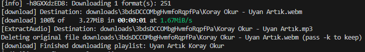
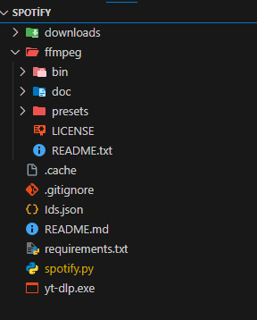
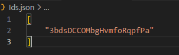

# Spotify Playlist Downloader



This project allows you to download Spotify playlists in MP3 format.

Bu proje, Spotify oynatma listelerini MP3 formatında indirmenizi sağlar.

## Notes / Notlar

- Spotify oynatma listeleri spotify'a ait oynatma listelerini lütfen yeni oynatma listesinde oluşturun. Aksi takdirde oynatma listesi bulamaz.
  Spotify playlists please create spotify playlists in the new playlist. Otherwise, the playlist may not be found.

- Ffmpeg'i indirdikten sonra ana diziye ekleyin. Aksi takdirde `ffprobe and ffmpeg not found. Please install or provide the path using --ffmpeg-location` hatası alırsınız.

- Dosyalar böyle olması şarttır!



## Installation / Kurulum

1. Install the required Python libraries:
   Gerekli Python kütüphanelerini yükleyin:

   ```bash
   pip install -r requirements.txt
   ```

2. Add the Spotify playlist IDs you want to download to the `Ids.json` file.
   `Ids.json` dosyasına indirmek istediğiniz Spotify oynatma listesi ID'lerini ekleyin.

   

3. Set your Spotify API credentials in the `spotify.py` file.
   `spotify.py` dosyasındaki Spotify API kimlik bilgilerinizi ayarlayın.

## Usage / Kullanım

1. Run the `spotify.py` file.
   `spotify.py` dosyasını çalıştırın.

2. The download process will be completed and the downloaded files will be in the `downloads` folder.
   İndirme işlemi tamamlandığında, indirilen dosyalar `downloads` klasöründe bulunacaktır.

## Requirements / Gereksinimler

- Python 3.x
- `spotipy`
- `yt-dlp`
- `ffmpeg`

## Notes / Notlar

- FFMPEG: https://ffmpeg.org/download.html
- Spotify API: https://developer.spotify.com/
- YT-DLP: https://github.com/yt-dlp/yt-dlp/releases

- Make sure `ffmpeg` is installed and accessible in your system PATH.
  `ffmpeg`'in yüklü olduğundan ve sistem PATH'inde erişilebilir olduğundan emin olun.

- This script is for personal use only and may violate Spotify's terms of service if used otherwise.
  Bu script sadece kişisel kullanım içindir ve başka bir şekilde kullanılırsa Spotify'ın hizmet şartlarını ihlal edebilir.
